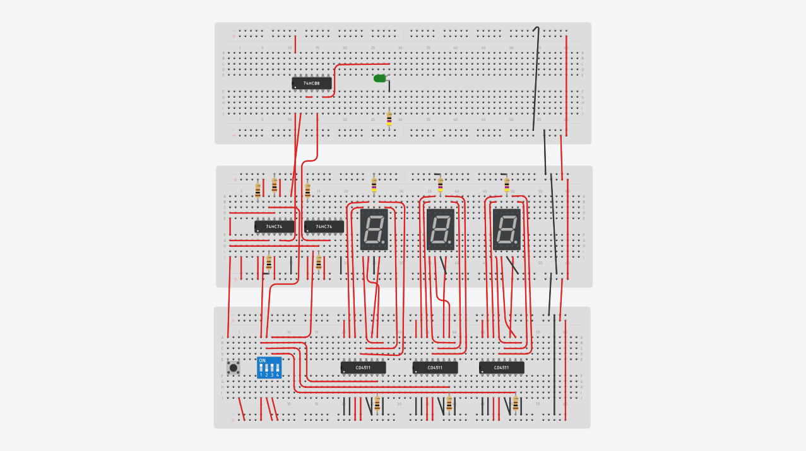
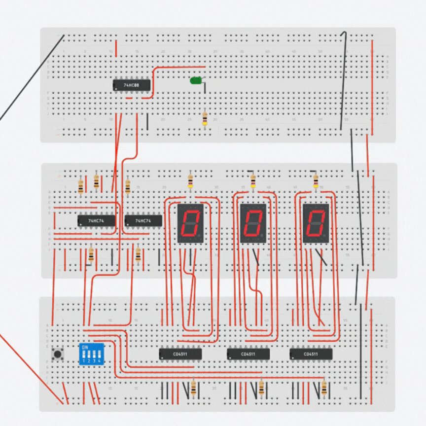
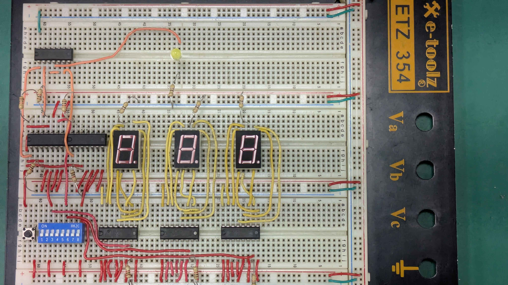

# 3-bit Digital Code Checker with Latch Memory

A hardware-based security system designed to verify a 3-bit binary password. This project demonstrates the integration of **Combinational Logic** (for verification) and **Sequential Logic** (for data storage).

## Project Overview
The system allows a user to input a 3-bit code via DIP switches, visualize the input on 7-segment displays, and "lock" the data into memory using Flip-Flops. A logic gate array then compares the stored bits against a preset password (**101**).

## System Architecture

### 1. Input & Display Section
- **Device:** 8-bit DIP Switch (3 bits utilized).
- **Decoder:** CD4511 BCD-to-7-Segment Decoder.
- **Display:** Common Cathode 7-Segment Display.
- **Key Configuration:** - To display only '0' or '1', only the **LSB (Pin A0)** is connected to the signal; inputs A1, A2, and A3 are grounded.
  - **Pin $\overline{LT}$ (Lamp Test):** Tied to **High** to disable testing mode.
  - **Pin $\overline{BI}$ (Blanking):** Tied to **High** to enable the display output.
  - **Pin $LE$ (Latch Enable):** Tied to **Low** to keep the decoder in **Transparent Mode**, allowing real-time updates from the switches.

### 2. Storage Section (Memory)
- **Device:** D Flip-Flops.
- **Clock Control:** A push button triggers the clock pulse to "latch" the current DIP switch values into the Flip-Flops.
- **Stability:** Both **Set (S)** and **Reset (R)** pins are grounded to disable asynchronous functions, ensuring the state only changes via the Clock and D inputs.

### 3. Verification Logic
The system verifies the stored code against the preset password **101**. 
- **Logic Gates:** Two AND gates and one Inverter ($Q2'$).
- **Boolean Expression:** $$Output = Q_1 \cdot \overline{Q_2} \cdot Q_3$$
- **Output:** A High signal triggers an **LED indicator** when the logic condition is met.

## Simulation

*Figure 1: Complete circuit layout designed in Tinkercad.*

## Demonstration

*Watch the full demonstration video [here](https://drive.google.com/file/d/1rHWM3Ba40MnHvZpK7oHRWY_VCJT5ww_l/view?usp=drive_link).*

## Lessons Learned
- Understanding **Active-High vs. Active-Low** configurations for the CD4511 IC.
- Managing **signal stability** by grounding unused inputs to prevent floating states.
- Implementing **synchronous data transfer** using manual clock pulses.

---
During the Digital Systems Design Lab Course, 2025.